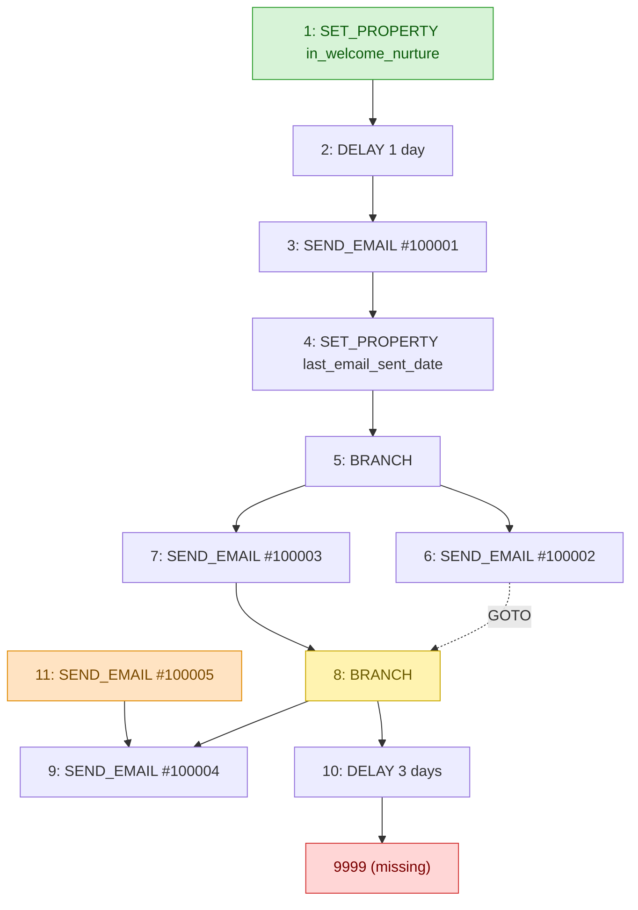

# hsflow: a HubSpot Workflows v4 toolkit

A small **Python client + static analyzer** for the HubSpot Workflows
(Automation) **v4** API.

Pull a workflow definition, then audit it for the structural defects the HubSpot
UI hides behind its drag-and-drop canvas: **dangling links, unreachable
("orphan") steps, branches with no default path, GOTO loops, and a broken start
action**. The analyzer is pure and offline, so you can audit a saved flow JSON
with no credentials.

> Built out of real marketing-operations work auditing large HubSpot portals
> (workflow logic, deliverability, and A/B-test resolution). Every example in
> this repo uses **synthetic** data, with no portal ids, contacts, or real assets.

[](https://github.com/JerushaGray/hubspot-workflows-toolkit/actions/workflows/ci.yml)
[](https://www.python.org/)
[](LICENSE)

---

## The action graph, made visible

`hsflow analyze examples/sample_flow.json --mermaid` renders the flow as a
diagram with the defects highlighted. This is the bundled synthetic sample:



Legend: **red** = a dangling link (points at a missing action), **orange** = an
orphan (unreachable from the start), **yellow** = a branch with no default,
**green** = the start. Dashed arrows are GOTO edges. The same defects come out of
plain `hsflow analyze` as text (see Quickstart below).

For why a finding like the yellow one matters in contacts and pipeline (not just
as a lint nit), see [A finding in context](docs/field-example.md).

## Why it exists

In a v4 flow, every step has an internal numeric `actionId` that **never appears
in the editor**. The canvas will happily show you a workflow whose branch points
at a deleted step, or whose "Package B" path can never be reached, because the
breakage lives only in the action graph, not the visuals. `hsflow` reads the
JSON the API returns and makes those problems obvious.

It also encodes the field-level knowledge you only get by working with the API:
`delta` is in **minutes** (not ms), the stats endpoint demands **ISO-8601**
timestamps, the modern Lists API needs a **legacy fallback**, and the runtime
error log simply **isn't in the public API** (see [docs](docs/workflows-v4-reference.md)).

## Features

- **Typed client** for the endpoints that matter: workflow def, list def (with
  legacy fallback), marketing email, and per-email statistics. Retries `429`/`5xx`
  and transient connection errors with backoff (honoring `Retry-After`), and
  surfaces every failure as one `HubSpotError` type.
- **Offline flow analyzer** that builds the action graph and reports:
  - `DANGLING_LINK`: a step points at an action id that doesn't exist
  - `ORPHAN_ACTION`: a defined step unreachable from the start (dead step)
  - `BRANCH_NO_DEFAULT`: a branch that may silently drop unmatched contacts
  - `GOTO_EDGE`: merges and loops to follow and confirm they terminate
  - `START_NOT_FOUND`: the start action is missing or undefined (broken entry point)
  - plus an action-type breakdown, delay inventory (humanized), and the email
    and list ids the flow references.
- **Crosswalk resolver** that turns those raw ids into labels: `content_id` to
  email name/subject, `listId` to list name/size, and each branch's path names.
  Deleted or inaccessible assets are flagged, not silently skipped.
- **CLI** with `analyze`, `decode`, `crosswalk`, `pull-flow`, and `pull-list`.
- **No credentials needed to try it.** A synthetic sample flow ships in
  [`examples/`](examples/sample_flow.json).

## Install

```bash
git clone https://github.com/JerushaGray/hubspot-workflows-toolkit.git
cd hubspot-workflows-toolkit
pip install -e .          # installs the `hsflow` command + the requests dep
```

## Quickstart (no credentials)

```bash
hsflow analyze examples/sample_flow.json
```

```text
Flow: [SAMPLE] Welcome Nurture (synthetic)  (id=100200300, enabled=True)
Start action: 1   Actions: 11
Action types: DELAY=2, LIST_BRANCH=2, SEND_EMAIL=5, SET_PROPERTY=2
Delays: 2:1 day, 10:3 days
Branches: 2 (1 without a default)
Emails sent: 5  content_ids=['100001', '100002', '100003', '100004', '100005']
Lists referenced: ['5001', '5002', '5003']
Terminals: ['9']
GOTO edges: 6->8

Findings: 1 error(s), 2 warning(s), 1 info
  ERROR   DANGLING_LINK [action 10]: points to action 9999, which does not exist (broken link).
  WARNING BRANCH_NO_DEFAULT [action 8]: LIST_BRANCH with 2 branch(es) and no default: ...
  WARNING ORPHAN_ACTION [action 11]: defined but unreachable from the start action (dead step).
  INFO    GOTO_EDGE [action 6]: GOTO -> action 8 (merge/loop); confirm any loop can terminate.
```

`analyze` exits non-zero when there are errors, so it drops straight into CI
(`0` = clean, `1` = defects found, `2` = could not run). Add `--json` for a
machine-readable report.

## Pull and audit a real workflow

Set a [private-app token](https://developers.hubspot.com/docs/api/private-apps)
(scopes: automation + marketing email + crm lists):

```bash
export HUBSPOT_TOKEN="pat-na1-..."      # or use --token / --token-file

hsflow pull-flow 123456789              # -> flow_123456789.json
hsflow analyze flow_123456789.json
hsflow pull-list 4092                   # -> list_4092.json
```

## Resolve ids to labels (crosswalk)

`analyze` is offline, so it reports the raw ids a flow uses (`content_id`,
`listId`). `crosswalk` resolves them to names through the API, which is what
makes a finding reportable: "action 10 points at a deleted email" lands where
"action 10 -> 9999" does not.

```bash
hsflow crosswalk flow_123456789.json          # text
hsflow crosswalk flow_123456789.json --md     # Markdown crosswalk doc
```

```text
Crosswalk: [NURTURE] Welcome (id=123456789)

Emails (content_id -> name | subject | state)
  100001  Welcome aboard  "Welcome!"  [PUBLISHED]
  100005  (unresolved: HTTP 404 - deleted or no access)

Lists (listId -> name | size | source)
  5001  Engaged in last 30 days  size=12345  [crm/v3]

Branches (action id -> paths [default])
  8  Has Package A / Has Package B  [no default]
```

A lookup that 404s (a deleted or inaccessible asset) is recorded, not raised,
since a send or stamp pointing at a deleted email is exactly what an audit wants
to catch. In code:

```python
from hsflow import WorkflowsClient, build_crosswalk, format_crosswalk

client = WorkflowsClient()
flow = client.get_flow("123456789")
cw = build_crosswalk(flow, client)

print(format_crosswalk(cw, markdown=True))
cw.unresolved          # ['email 100005']  (deleted or no access)
```

## Library usage

```python
from hsflow import WorkflowsClient, build_report, format_report

client = WorkflowsClient()                       # reads HUBSPOT_TOKEN
flow = client.get_flow("123456789")
report = build_report(flow)

print(format_report(report))
if report.errors:
    raise SystemExit("flow has broken links")

# Structured access:
report.orphans            # ['11']
report.dangling           # ['9999']
report.branches           # [{'action_id': '8', 'has_default': False, ...}, ...]
report.delays             # [{'action_id': '2', 'minutes': 1440, 'human': '1 day'}, ...]
report.content_ids        # marketing-email ids this flow sends

# Per-email stats (ISO-8601 is handled for you):
from datetime import datetime, timezone
stats = client.get_email_statistics(
    report.content_ids,
    start=datetime(2026, 3, 1, tzinfo=timezone.utc),
    end=datetime(2026, 3, 8, tzinfo=timezone.utc),
)
```

The analyzer takes a plain `dict`, so it works on any saved flow JSON without a
client or network access.

## CLI reference

| Command | Auth | Description |
| --- | --- | --- |
| `hsflow analyze <flow.json> [--json] [--mermaid]` | none | Audit a flow, or render it as a Mermaid graph |
| `hsflow decode <actionTypeId>` | none | Explain an action type id (e.g. `0-4`) |
| `hsflow crosswalk <flow.json> [--md]` | token | Resolve a flow's email/list/branch ids to labels |
| `hsflow pull-flow <id> [--out F]` | token | `GET /automation/v4/flows/{id}` to a file |
| `hsflow pull-list <id> [--out F]` | token | `GET` a list def (v3, legacy fallback) to a file |

## How a v4 flow is structured

| `actionTypeId` / `type` | Meaning | Key fields |
| --- | --- | --- |
| `0-1` | **DELAY** | `fields.delta` in **minutes** (days = `delta / 1440`) |
| `0-4` | **SEND_EMAIL** | `fields.content_id` = the marketing email id |
| `0-5` | **SET_PROPERTY** | `fields.property_name` + value (static or `EXECUTION_TIME` stamp) |
| `LIST_BRANCH` (`type`) | **Branch** | `listBranches[]` of conditions + optional `defaultBranch` |

Connections carry `edgeType`: `STANDARD` (the normal next step) or `GOTO` (a jump
to an existing action, used for merges and loops). The full catalog is larger, so
unrecognized ids decode as `UNKNOWN` rather than being guessed at. See the
[reference doc](docs/workflows-v4-reference.md) for the endpoints and gotchas.

## Security

This tool **never hard-codes or logs your token**. It is read from `--token`,
`HUBSPOT_TOKEN`, or a token file at call time. The included `.gitignore` blocks
`.env`, `*.token`, and any pulled `flow_defs/` and `list_defs/` so real portal
data and secrets never get committed. Treat a private-app token like a password.

## Development

```bash
pip install -e ".[dev]"
pytest
```

## License

MIT. See [LICENSE](LICENSE).
